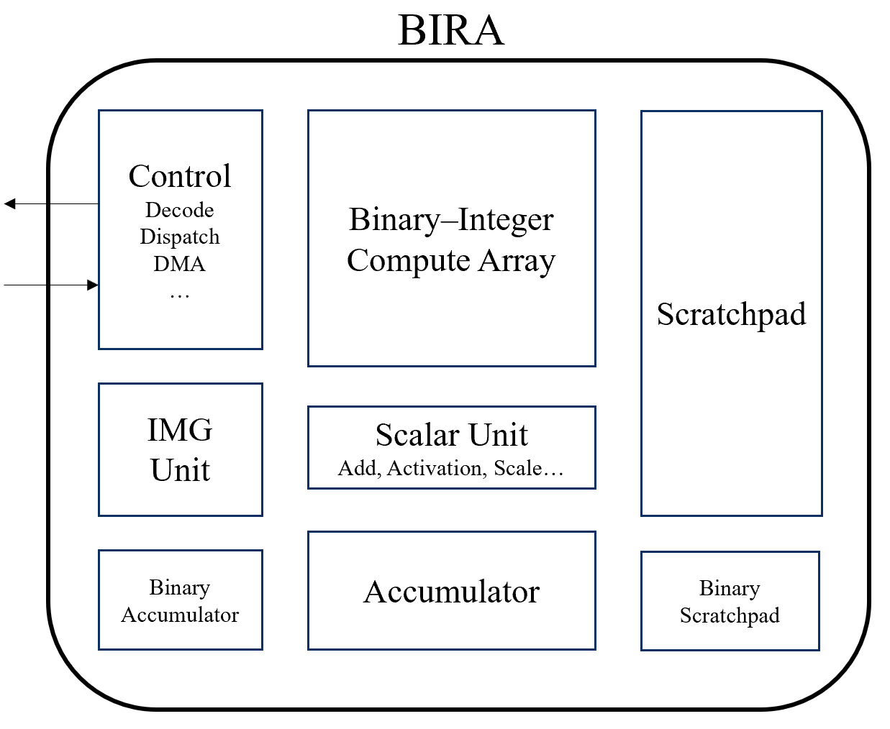
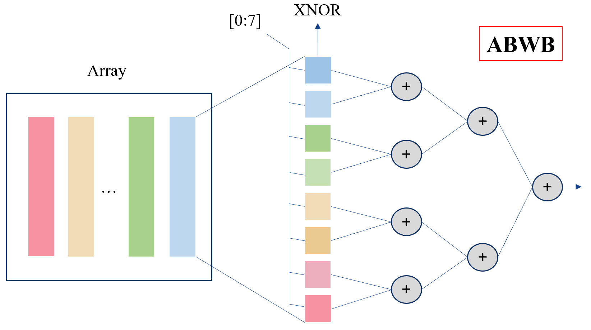
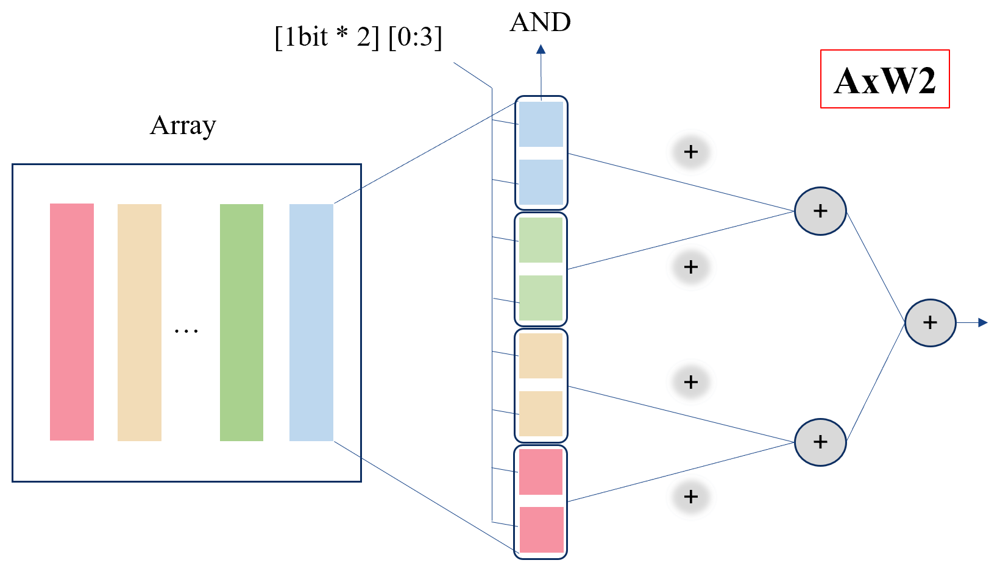
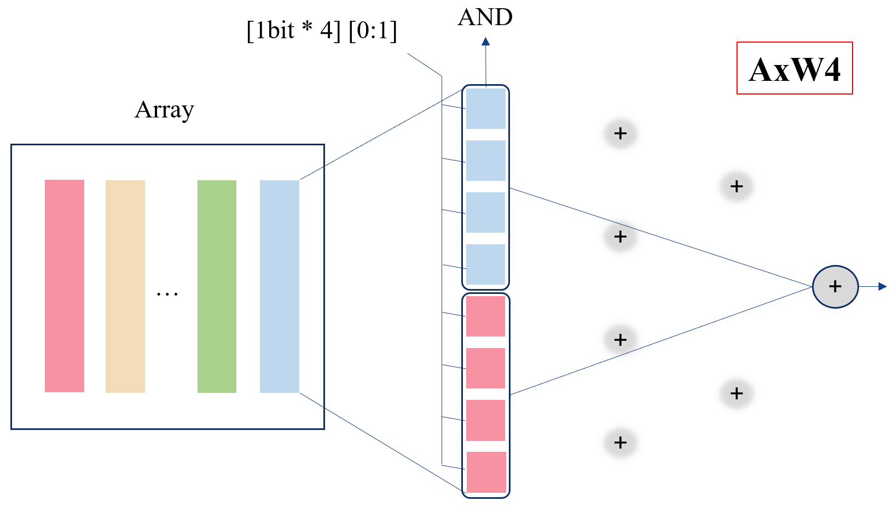
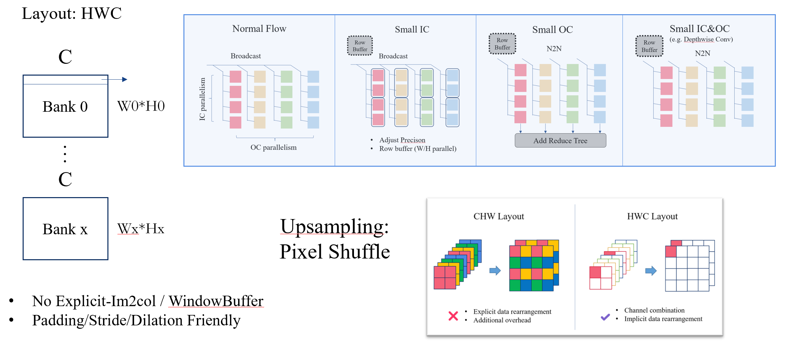
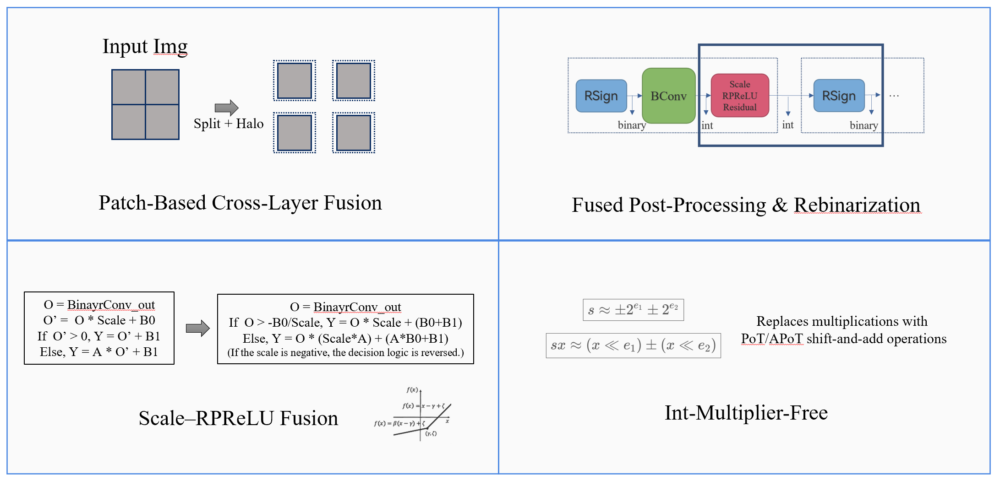

# BIRA：统一二值—整数可重构加速器

[English](README.md) | **简体中文**

BIRA（Binary–Integer Reconfigurable Accelerator）是一个使用 Chisel 开发的二值与低比特神经网络加速器，面向端侧图像超分辨率等算力、存储和访存带宽受限的场景。项目以软硬件协同设计为核心，在同一计算阵列上统一支持二值 XNOR-popcount 与 W2/W4/W8/W16 整数运算，并通过可配置数据流、片上存储规划、算子融合和隐式数据重排兼顾通用卷积网络支持与超分模型优化。

BFSRCNN x4 是当前最完整的端到端样例，覆盖训练与量化、参数导出、手写网络描述、Runtime 规划、独立 RTL 仿真和 Chipyard 裸机执行。BIRA 的硬件与 Runtime 并不绑定 BFSRCNN 的层名或拓扑。

BIRA 是一个探索性项目，目前仍在持续开发，尚未形成完整的性能评估与通用编译器。

## 项目起源

端侧图像超分通常以卷积神经网络为主体。较深的网络能够获得更好的重建能力，却也带来大量参数、计算和中间特征，使受限设备难以同时满足延迟、功耗和存储要求。二值化与低比特量化能够显著压缩模型，并将乘加转换为更简单的位运算和整数运算，但通用处理器和传统高精度加速器并不能自然发挥这种优势：位打包与格式转换会产生额外开销，二值层和首尾整数层之间的计算强度差异也容易造成计算资源闲置。

BIRA 因此选择专用加速器路线，同时避免把硬件做成只服务单一网络的固定流水线。它试图解决三个相互关联的问题：

- 如何让二值层和不同权重精度的整数层高效复用同一套物理计算资源；
- 如何用数据布局、地址生成和后处理融合减少超分网络中的数据搬运；
- 如何由软件描述网络，并自动完成跨层片上存储规划和 ISA 指令提交。

## 设计理念

### 通用机制与场景优化并存

BIRA 的硬件提供 Conv、FC 等通用计算模式，使用 Tensor 与层描述表达网络。在此基础上，超分辨率所需的 PixelShuffle 布局、双线性残差和二值后处理融合，则通过通用地址生成选项、后处理选项和部署软件组合实现。

### 精度与数据流可配置

默认阵列支持 A8 激活、二值权重以及 W2/W4/W8/W16 整数权重。精度选择不仅决定数据宽度，还决定阵列中的操作数组合、加法树入口和数据分发方式，使同一物理阵列能够适配整数及二值卷积。

### 软件负责全局决策，硬件负责高效执行

模型工具完成量化与参数布局，程序员用公开结构描述 Tensor 和算子，推理引擎再分析 Tensor 生命周期、分配片上地址、安排 bank 乒乓并消除不必要的层间 DMA。硬件只接收已规划的 Context 和动态任务，负责依赖检查、调度、搬运、计算与后处理。

## 架构总览



*BIRA 由控制与 DMA、统一二值—整数计算阵列、标量后处理、累加器以及 Full/Binary Scratchpad 组成。*

BIRA 借鉴了 Gemmini 的 RoCC 接入方式、Decoupled Access/Execute 思想、显式 Scratchpad 管理和“独立仿真 + SoC 全系统仿真”的验证流程。具体实现具有以下特点：

- 通过 Rocket `CUSTOM_3` 指令作为 RoCC 加速器集成到 Chipyard；
- 为 Load、Execute 和 Store 设置独立队列，并依据片上 bank 的 RAW、WAR、WAW 相关性进行受约束乱序发射；
- 将核心路径划分为 Compute、Accumulator 和 Post/writeback 阶段，通过队列和反压实现阶段重叠；
- 使用 current/prefetched 双权重缓冲隐藏 tile 切换时的权重读取延迟；
- 由软件在相邻层之间安排 SPAD bank 乒乓。

独立顶层 `StandaloneTop` 使用简单的存储接口，适合模块验证、trace 回放和加速器内部周期分析；Chipyard 形态则加入 Rocket、私有 TLB/PTW 和 TileLink DMA，用于裸机程序及完整系统验证。

## 二值—整数计算阵列

二值神经网络通常仍包含输入、输出或特征变换所需的整数层。若为二值和整数计算分别设置独立阵列，两类阵列会因负载不均而交替空闲；若强行组成固定并行流水，又会增加调度与均衡难度。BIRA 将二值和整数计算映射到相同的可配置 bit cell 与加法规约树，使物理算力能够随当前层的精度和数据流重新组织。

默认阵列包含 16 个 lane，每列包含 16 个可配置 bit cell：

- 二值模式下，bit cell 执行 XNOR，整列结果进入 popcount 树；
- 整数模式下，bit cell 执行激活位与有符号权重位的 AND，并按二补码权重解释局部结果；
- AND 是两种模式共享的基础逻辑，二值模式额外计入 `0 == 0`，从而形成 XNOR；
- A8 激活按 bit-plane 送入阵列，W2/W4/W8/W16 权重在列内分别组成 8/4/2/1 组操作数，再由控制器按激活位权重移位并合并；
- 可配置加法树允许 1、2、4、8 或 16 个操作数从匹配层级进入，无需为每种精度复制一套完整乘法阵列。



*二值模式：bit cell 执行 XNOR，并由完整加法树完成 popcount。*



*A8×W2 模式：相邻 bit cell 组成 W2 操作数，并从匹配层级进入加法树。*



*A8×W4 模式：四个 bit cell 组成 W4 操作数，阵列并行度随精度重组。*

这种实现不采用激活与权重均逐位展开的全 bit-serial 计算。权重位的符号和位置信息在列内保留，激活 bit-plane 的结果也在本地重构，因此整数路径无需物理多比特乘法器，同时避免全串行方案带来的额外循环。

## 张量布局与可配置数据流



*HWC 布局、可配置输入分发与归约，以及 PixelShuffle 的隐式数据重排。*

Full SPAD 以 16 个连续通道为一行，逻辑 Tensor 通常采用类似 `HWC16` 的通道连续分块布局。卷积控制器根据输出坐标、kernel tap 和通道块直接生成本地地址，越过 padding 边界的 tap 不会发起读取，因此不需要`im2col` 或 window buffer。

阵列整体采用权重固定的数据复用策略，并通过输入分发、权重组织和输出归约适配不同算子：

| 模式 | 输入与权重组织 | 阵列列的含义 | 典型用途 |
|---|---|---|---|
| Dense | 激活标量或分组广播，权重按输出通道组织 | 输出通道 | 普通卷积、1×1 卷积 |
| Depthwise | 输入 lane 与计算列一一单播 | 输入/输出通道 | 深度卷积 |
| Column reduce | 输入通道分发到不同列，输出端再次归约 | 输入通道 | 输入通道多、输出通道少的 final/reduce 算子 |
| Binary | 打包激活和权重进入 XNOR-popcount 路径 | 输出通道或映射组 | 二值卷积 |

对于 PixelShuffle 一类数据重排，BIRA 在前一层写回时直接生成后一层需要的 pixel-pair 布局，后续地址生成器再按高分辨率坐标读取。重排因此表现为写地址和通道索引变化，而不是一次独立的数据重排。

## 算法—硬件协同优化



*带 halo 的跨层 patch 执行、融合后处理与再次二值化、Scale–RPReLU 融合，以及基于 PoT/APoT 的无乘法缩放。*

### 带 halo 的图像 patch

部署软件可以将大图切分为带 halo 的 patch，使单次推理的输入、中间特征和活跃参数更容易适配片上存储。有效区域用于最终拼接，halo 为边缘卷积提供上下文；代价是边界附近存在少量重复计算。patch 切分、halo 选择和结果拼接由软件负责。

### 跨层驻留与融合

`bira_inference()` 可以一次接收多层描述。推理引擎识别 Tensor 的首次和最后一次使用，让生命周期不重叠的 Tensor 复用空间，并让相邻层的中间结果保留在 Full/Binary SPAD 中。对于二值层，前一层后处理还可以直接产生下一层所需的打包二值输出，避免存储高精度中间 Tensor 后再执行独立 sign 操作。

### 二值后处理融合

二值双极性点积满足：

```text
dot = 2 × popcount(XNOR(a, w)) - N
```

阵列和 Accumulator 保存 `2 × popcount`，Parameter Buffer 按有效 kernel 和通道数提供 correction（即 `-N`），后处理阶段直接完成校正。缩放、阈值判断、RPReLU、残差相加、饱和以及可选的再次二值化也可沿同一路径执行，减少独立算子和中间数据写回。

### Scale 与 PReLU/RPReLU 融合

二值卷积通常先对点积结果执行逐通道缩放和偏置，再进入 RPReLU。若依次实现这些操作，就需要先生成缩放后的中间 Tensor，再根据激活分支执行一次 PReLU 类变换。BIRA 在量化阶段将二值卷积的 scale、卷积 bias 和 RPReLU 参数合并成作用于原始整数点积 `x` 的两个仿射分支。设卷积 scale 为 `s`、卷积 bias 为 `b_c`，RPReLU 的平移参数为 `b_0` 和 `b_1`、负半轴斜率为 `α`，则融合结果可以写成：

```text
t = b_0 + s × b_c

x >= -t / s : y = s × x       + t     + b_1
x <  -t / s : y = α × s × x   + α × t + b_1
```

量化工具预先计算分支阈值、正负分支的 scale 和 bias，并将其写入 Parameter Buffer；硬件根据阈值选择分支，直接对 `2 × popcount - N` 执行对应的仿射变换，再完成残差相加、饱和及可选的 sign 输出。这样，卷积缩放、RPReLU 和后续状态更新在同一后处理流水中完成，无需单独的 scale/PReLU 算子，也不需要存储缩放后的中间结果。普通整数层的 PReLU 同样由 `IntPostProc` 在卷积累加之后完成，其正负分支系数通过移位和加减实现。

### 无多比特乘法的定点缩放

量化工具使用 2 的幂（PoT）尺度和两项加法幂次（APoT）系数近似乘法形式的缩放。硬件以移位和加减实现多比特 requantization 及二值 RPReLU 分支，因此计算和后处理路径不需要通用多比特乘法器。

\[
\boxed{s\approx \pm2^{e_1}\pm2^{e_2}}
\]
\[
\boxed{sx\approx (x\ll e_1)\pm(x\ll e_2)}
\]

## ISA 与解耦执行

BIRA ISA 使用 Rocket `CUSTOM_3` opcode，并将“层的静态配置”与“运行时任务”分离：

| 指令类别 | 主要作用 |
|---|---|
| `CFG_SHAPE` | 配置输入/输出形状、kernel 和 padding |
| `CFG_ADDR` | 配置 SPAD、Accumulator 与 Parameter Buffer 的本地行地址 |
| `CFG_MODE` | 配置阵列模式、权重精度、符号属性和后处理选项 |
| `CFG_COMMIT` | 冻结配置并形成不可变 Context 快照 |
| `LOAD_2D` / `STORE_2D` | 在外部内存与片上存储之间提交二维搬运任务 |
| `EXEC` | 使用指定 Context 提交卷积执行任务 |
| `FENCE` / `STATUS` / `TLB_FLUSH` | 提供完成同步、状态查询和地址转换维护 |

Load、Execute 和 Store 分别进入独立队列。调度器根据 Context 声明的 bank 读写集合检查依赖，允许无冲突的年轻任务越过被阻塞的旧任务发射；Context 快照保证后续配置不会改变已排队任务的语义，`FENCE` 则建立软件可观察的完成边界。

外部 DRAM 地址以字节为单位，本地 SPAD、Accumulator 和 Parameter Buffer 地址以行为单位。Parameter Buffer 的 64 B 记录保存 bias、requantization、threshold、correction 等后处理参数。

## 软件栈

BIRA 采用“模型专用导出 + 通用推理引擎与 Runtime”的分层方式：

| 阶段 | 开发者提供 | 工具或 Runtime 完成 |
|---|---|---|
| 训练与量化 | 模型、数据和量化配置 | 生成量化 checkpoint |
| 参数导出 | 选择 checkpoint 和模型适配器 | 生成 C 权重、bias、量化参数和 Parameter Buffer 数组 |
| 网络描述 | 手写 Tensor 与层描述 | 建立层间连接和算子属性 |
| 跨层规划 | 将一层或多层传给 `bira_inference()` | 校验形状、分析生命周期、分配 SPAD、规划 DMA 与 bank 乒乓 |
| 指令执行 | 绑定外部输入输出 | Runtime 生成并提交 CFG、LOAD、EXEC、STORE 和 FENCE |

参数导出工具不会生成网络拓扑或推理 C；程序员也不需要手写 SPAD 地址、RoCC 编码或逐条 ISA 指令。传入单层时，同一 API 可用于单算子验证；传入完整层数组时，推理引擎会进行整网范围内的跨层优化。

Runtime 提供两种后端：RoCC Driver 在 Chipyard 中执行真实 RV64 指令，Trace Driver 则在主机端记录相同的命令和外部内存镜像，供 ChiselTest 与独立 Verilator 回放。这使软件生成的执行计划能够在快速模块验证和完整 SoC 验证之间复用。

## 当前支持范围

- 默认 16-lane 阵列、A8 激活和 32-bit Accumulator；
- 二值以及 W2/W4/W8/W16 权重路径；
- Dense、Depthwise、Column-reduce 和 Binary 数据流；
- Full/Binary SPAD、Accumulator 与 Parameter Buffer；
- Decoupled Load/Execute/Store、bank 相关检查与受约束乱序发射；
- 权重预取、计算/累加/后处理流水及跨层 SPAD bank 乒乓；
- 二值后处理融合、PoT/APoT 定点缩放、隐式 PixelShuffle 和双线性残差；
- ChiselTest、独立 Verilator 与 Chipyard Verilator 三层验证。

## 测试验证

BIRA 采用软件单元测试、ChiselTest、独立 Verilator 和 Chipyard Verilator 的分层验证流程。当前记录的 BFSRCNN x4 测试以 32×32 灰度图为输入、128×128 图像为输出。优化后的独立 RTL 已通过 16,384 B golden 输出校验；当前版本的 Chipyard 端到端性能尚待重新实测。

| 结果 | 数值 |
|---|---:|
| 最近一次实测的优化后独立 BIRA RTL，14 层有效推理 | 4,602,938 周期 |
| 按 200 MHz 换算的独立 RTL 单帧延迟 | 23.015 ms |
| 按 200 MHz 换算的独立 RTL 理论帧率 | 43.45 FPS |
| 当前版本 Chipyard `bfsrcnn_infer()` | 待重新实测 |

## 快速开始

以下命令默认从 Chipyard 根目录执行，且 BIRA 位于 `generators/bira`。

运行软件基础测试：

```bash
cd generators/bira/sw
make test
```

运行硬件测试：

```bash
cd generators/bira/hw
sbt test
```

从 BFSRCNN 参数与 fixture 生成开始运行独立端到端 Verilator：

```bash
cd generators/bira/sw
make bfsrcnn-verilator
```

只生成独立顶层 RTL：

```bash
cd generators/bira/hw
sbt "runMain bira.GenStandaloneTop build/generated-rtl"
```

## 仓库布局

```text
bira/
├── hw/          通用 Chisel RTL、ChiselTest 和独立 Verilator
├── sw/          量化/部署工具、C Runtime、模型应用和仿真工具
├── chipyard/    LazyRoCC、TLB/PTW、TileLink DMA 和 SoC Config
├── patches/     面向指定 Chipyard 版本的构建系统补丁
└── scripts/     Chipyard 安装、检查和卸载脚本
```

## 后续工作

- [ ] 优化硬件细节、关键路径和资源利用率；
- [ ] 建立统一的性能、面积、功耗与模型质量评估记录；
- [ ] 扩展算子、模型适配和自动化部署能力，提高软件栈通用性；
- [ ] 探索多阵列、NoC 和配套 simulator，以支持更大规模计算与扩展。
